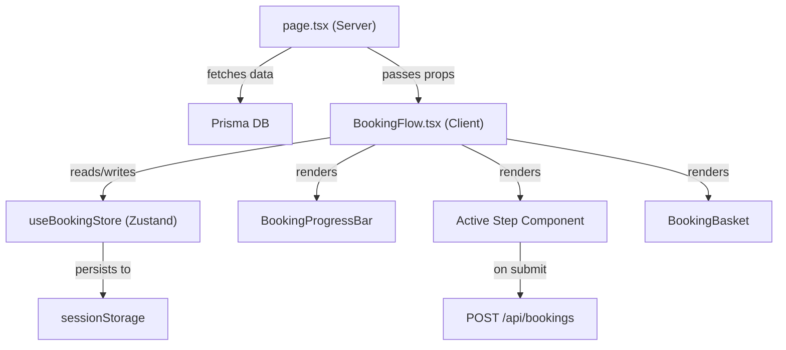
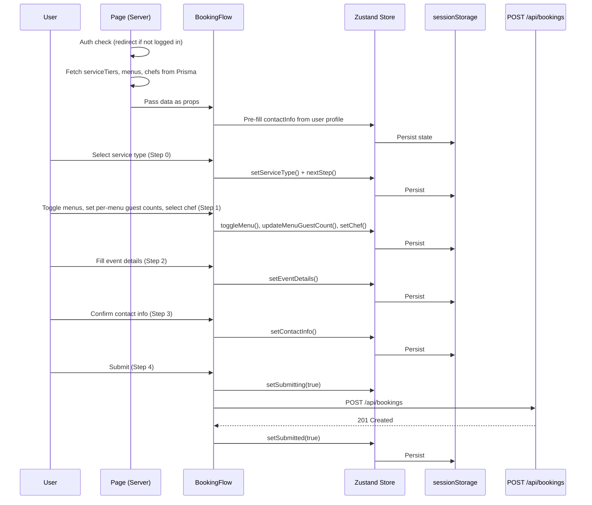

# Booking Page Implementation

## Overview

The standalone booking page is a multi-step, immersive booking experience located at `/[locale]/booking`. It lives outside the `(user)` profile layout, providing a focused, premium flow for creating catering bookings.

**Key Change:** The flow now supports multiple menus per booking, with a separate guest count specified for each selected menu.

## Architecture



## Route Structure

| File | Type | Purpose |
|------|------|---------|
| `app/[locale]/booking/layout.tsx` | Server | Minimal layout: Navbar only, no footer |
| `app/[locale]/booking/page.tsx` | Server | Auth gate, data fetching, renders `<BookingFlow />` |

## State Management — Zustand Store

**File:** `lib/store/use-booking-store.ts`

The booking state is managed by a Zustand store with `persist` middleware using `sessionStorage`. This ensures:
- State survives page refreshes and navigation
- State is automatically cleared when the browser tab is closed
- All step components read/write from a single source of truth

### Store Shape

```typescript
interface BookingState {
  currentStep: number;                    // 0-4
  serviceType: BookingServiceType | null; // CORPORATE | PRIVATE | WEDDING | VIP | OTHER
  selectedMenus: {                        // Array of selected menus with their guest counts
    menuId: string;
    guestCount: number;
  }[];
  chefProfileId: string;                  // Optional chef selection
  eventDetails: BookingEventDetails;      // eventDate, eventTime, venue, venueAddress
  contactInfo: BookingContactInfo;        // contactName, contactPhone, contactEmail, specialRequests
  isSubmitting: boolean;
  isSubmitted: boolean;
  submissionError: string | null;
}
```

### Key Actions

| Action | Description |
|--------|-------------|
| `setServiceType(type)` | Sets service type, called from Step 0 |
| `toggleMenu(menuId, [defaultGuestCount])` | Adds/removes a menu from selection |
| `updateMenuGuestCount(menuId, count)` | Updates guest count for a specific selected menu |
| `setChef(chefId)` | Sets optional chef preference |
| `setEventDetails(partial)` | Merges partial event details |
| `setContactInfo(partial)` | Merges partial contact info |
| `nextStep()` / `prevStep()` | Navigate between steps |
| `goToStep(n)` | Jump to a specific completed step |
| `resetBooking()` | Clears all state for a new booking |

### Persistence

Only user selections are persisted (via `partialize`), not transient UI state:
```typescript
partialize: (state) => ({
  currentStep: state.currentStep,
  serviceType: state.serviceType,
  selectedMenus: state.selectedMenus,
  chefProfileId: state.chefProfileId,
  eventDetails: state.eventDetails,
  contactInfo: state.contactInfo,
})
```

## Step Components

### Step 0: Service Type Selection
**File:** `components/booking/steps/ServiceTypeStep.tsx`

- Visual cards with full-bleed images for each service type
- Uses `staticServiceData` from `lib/service-data.ts` for images/icons
- Maps to `BookingServiceType`: CORPORATE, PRIVATE, WEDDING, VIP, OTHER
- Auto-advances to Step 1 after 300ms delay on selection
- Translations: `Services.*` namespace for titles/descriptions

### Step 1: Menu Selection
**File:** `components/booking/steps/MenuSelectionStep.tsx`

- Displays menus filtered by the resolved service tier
- Each menu card shows: tier badge, name, description, price/guest, item list
- Toggle selection with checkmark indicator
- **Per-menu Guest Count:** When a menu is selected, an input appears to set the guest count for that specific menu (default: 1).
- Optional chef selector dropdown
- Step is optional — user can skip without selecting any menus
- Translations: `Booking.steps.menuSelection.*`, `UserOrders.form.*`

### Step 2: Event Details
**File:** `components/booking/steps/EventDetailsStep.tsx`

- Event date (Calendar popover, disables past dates)
- Event time (time input)
- Venue name + optional address
- Shows estimated total only when menus are selected: `Sum(menu.pricePerGuest × menu.guestCount)`
- Validation: requires date, time, venue ≥ 2 chars
- Note: Guest count was moved to Step 1 (per-menu).

### Step 3: Contact Information
**File:** `components/booking/steps/ContactStep.tsx`

- Contact name, phone, email (pre-filled from user profile on first mount)
- Special requests textarea (optional)
- Validation: name ≥ 2 chars, phone matches `^[+]?[0-9]{8,15}$`, email contains `@`

### Step 4: Review & Submit
**File:** `components/booking/steps/ReviewStep.tsx`

- Summary grid showing all selections
- Itemized list of selected menus with their respective guest counts
- Estimated total (sum of all selected menu costs)
- Submits to `POST /api/bookings`
- Error display with retry capability
- Success state: confirmation message + "Back to Home" / "New Booking" buttons
- On success, `resetBooking()` is available to clear state

## Supporting Components

### BookingProgressBar
**File:** `components/booking/BookingProgressBar.tsx`

- Horizontal step indicator with icons per step
- Animated progress line showing completion
- Clickable for completed steps (can go back)
- Icons: Utensils → Utensils → CalendarDays → User → FileCheck

### BookingBasket
**File:** `components/booking/BookingBasket.tsx`

- Sticky sidebar on desktop, inline on mobile
- Shows live summary: service type, itemized list of selected menus with guest counts, chef, date/time
- Estimated total footer (only when menus selected)
- Empty state message when nothing selected yet

## Estimated Total Calculation

The estimated total is calculated consistently across EventDetailsStep, BookingBasket, and ReviewStep:

```
if (no menus selected) → total = 0
else → total = Σ(menu.pricePerGuest × menu.guestCount)
```

This ensures:
- Total starts at **0** before any menus are chosen
- Price is driven by each **menu's service tier**
- Each menu contributes its own cost based on its specific guest count

## API Integration

### Endpoint: `POST /api/bookings`

The ReviewStep submits the following payload:

```typescript
{
  serviceType: "CORPORATE" | "PRIVATE" | "WEDDING" | "VIP" | "OTHER",
  serviceTierId: string | null,
  selectedMenus: {
    menuId: string;
    guestCount: number;
  }[],
  chefProfileId: string | null,
  eventDate: "YYYY-MM-DD",
  eventTime: "HH:mm",
  venue: string,
  venueAddress: string | null,
  contactName: string,
  contactPhone: string,
  contactEmail: string,
  specialRequests: string | null
}
```

The API handler in `app/api/bookings/route.ts`:
1. Validates input with `createBookingApiSchema`.
2. Resolves the `serviceTier`.
3. Verifies all `selectedMenus` are active and match the resolved tier.
4. Calculates `totalPrice` as the sum of `(menu.pricePerGuest * guestCount)`.
5. Calculates `totalGuestCount` as the sum of all `guestCount` values (stored in `Booking.guestCount` for legacy/report compatibility).
6. Creates the `Booking` record in the database.
7. Updates the user's name and phone in their profile.

## Translations

### Namespace: `Booking`

Added to both `messages/en.json` and `messages/mn.json`:

| Key | Purpose |
|-----|---------|
| `Booking.title` | Page heading |
| `Booking.subtitle` | Page subheading |
| `Booking.steps.{stepKey}.title` | Progress bar step label |
| `Booking.steps.{stepKey}.heading` | Step content heading |
| `Booking.steps.{stepKey}.description` | Step content description |
| `Booking.steps.review.successTitle` | Submission success heading |
| `Booking.basket.title` | Basket sidebar heading |
| `Booking.basket.empty` | Basket empty state |

Also reuses keys from `UserOrders.*` and `Services.*` namespaces for form fields, validation messages, and service type labels.

## Data Flow



## File Inventory

| Path | Lines | Purpose |
|------|-------|---------|
| `lib/store/use-booking-store.ts` | ~170 | Zustand store with sessionStorage persistence |
| `app/[locale]/booking/layout.tsx` | ~14 | Minimal layout (Navbar only) |
| `app/[locale]/booking/page.tsx` | ~115 | Server component: auth, data fetch |
| `components/booking/BookingFlow.tsx` | ~170 | Client orchestrator |
| `components/booking/BookingProgressBar.tsx` | ~90 | Step progress indicator |
| `components/booking/BookingBasket.tsx` | ~180 | Sticky basket sidebar |
| `components/booking/steps/ServiceTypeStep.tsx` | ~120 | Visual service type cards |
| `components/booking/steps/MenuSelectionStep.tsx` | ~240 | Menu browser with toggles and per-menu guest counts |
| `components/booking/steps/EventDetailsStep.tsx` | ~249 | Date, time, venue (guest count removed) |
| `components/booking/steps/ContactStep.tsx` | ~145 | Contact info + special requests |
| `components/booking/steps/ReviewStep.tsx` | ~280 | Summary + submit |
